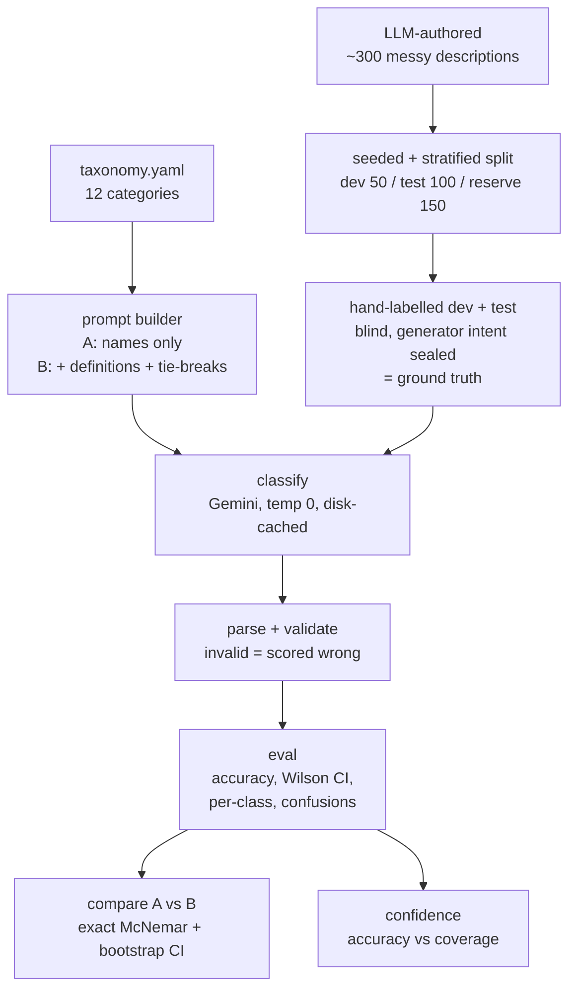

# Build log

## At a glance
- **The deliverable is the evaluation, not the classifier.**
- **The question:** do definitions and tie-breaks (Approach B) beat category names alone (Approach A)?
- **The answer:** yes on this data. B 99%, A 92% on 100 test rows, exact McNemar p = 0.016.
- **The catch:** it rests on 7 rows, and synthetic data makes 99% a ceiling, not a forecast.
- **How I worked:** Claude Code wrote the code; I approved every plan and reviewed every diff.

---

## 1. Framing and taxonomy

**Framing**
- KOHO's real question is "how do you know it's any good?"
- So I treated the **evaluation harness as the deliverable**.
- The classifier is about 150 lines (call, prompts, parsing).
- The real work: the harness, the labelling discipline, the statistics.

**The taxonomy: 12 categories for Canadian bank descriptors**
- Groceries, Dining, Transport, Shopping, Subscriptions, Bills & Utilities
- Health & Wellness, Entertainment, Travel, Fees & Interest, Income & Transfers, Other

**The one design rule that shaped everything**
- **Every tie-break must be decidable from a single description string.**
- A rule that needs outside information can't be applied by the model or by me.
  - Example: "is this payment recurring?"
  - Example: "what was actually bought?"
- So it adds noise, not signal.

**What that rule forced me to change**
- Subscriptions: defined by merchant type, not by recurrence.
- Pharmacy chains: Health & Wellness, regardless of purchase.

**The pipeline**

---

## 2. Where AI helped

**Claude (browser chat): a sounding board**
- Adversarial review of the evaluation plan.
- Choosing McNemar over a plain two-sample test.
- A second opinion that caught flaws in the first taxonomy draft.
- Sanity-checking my hand labels against my own rules.

**Claude Code (terminal): the builder**
- Wrote every harness module.
- Authored the synthetic data.
- Wrote the 57-test suite.

**How I supervised it**
- Plan mode first; I approved each plan.
- I reviewed every diff.
- Small commits, so the git history shows the supervision.

**It refused to guess about the SDK**
- I had it fetch Google's current quickstart and cite it, not code from memory.
- The page showed a newer Interactions API.
- That conflicted with my instruction to use `generate_content`.
- Claude Code flagged the conflict instead of quietly picking one.
- It said it had not confirmed whether Interactions supports temperature 0 and JSON output.
- I chose `generate_content` deliberately. I never confirmed Interactions lacks those controls.
- **This was AI correctly refusing to guess, not an AI error.**

**Separate model families**
- Authoring model: Claude. Classifier: Gemini.
- So the classifier wasn't grading its own family's output.

---

## 3. Where AI got it wrong (the part that matters most)

Three real cases. Each was caught by review, not luck.

**1. Discarded error body**
- What happened: `llm.py` threw away the API's error response.
- Impact: when I hit a 429, I couldn't tell a per-minute limit from a per-day one.
- How it was caught: I asked for the error detail, and nothing had been saved.
- Fix: the full body is now saved to disk, with the API key scrubbed.

**2. A labelling error in my own ground truth**
- What happened: both approaches said `FARMBOY` was Groceries. My label said Dining.
- The truth: Farm Boy is a grocer. My label was wrong.
- How it was caught: both approaches confidently disagreed with me in the same way.
- Lesson: when the model confidently disagrees with ground truth, re-check the ground truth.
- Honest caveat: I only re-checked rows the model got "wrong".
  - So this process can only ever raise measured accuracy.
  - It's a bias I can name, but can't fully remove at this scale.

**3. A sealed-data leak in a diff**
- What happened: Claude Code printed rows of the sealed generator-intent file while showing a commit.
- Impact: intended categories were exposed for a few ids.
- Fix: I moved those rows, plus others exposed in progress reports, into reserve.
  - 11 rows in total, so no evaluated row had been seen.
- Cost: 10 of the 11 were ambiguous, so the holdout lost some of its hardest cases.

---

## 4. What I rejected, and why

| Rejected | Why |
|---|---|
| **Few-shot as the core comparison** | A vs B is a cleaner single-variable test and needs no examples. Kept as future work. |
| **Forcing output to the 12 names** | It would push invalid outputs to near zero and hide that failure mode. I left output free and scored invalids as errors. There were 0, which is itself worth knowing. |
| **Tuning the model's thinking budget** | A second variable next to the prompt would confound the comparison. |
| **Switching models mid-run** | It would mix two models in one result set. When quota forced a switch (gemini-3.8-flash to gemini-3.5-flash-lite), I switched cleanly and re-ran everything. The cache key includes the model, so nothing mixes. |

---

## 5. What would worry me in production tomorrow

**1. Synthetic optimism**
- 99% is a ceiling.
- I wrote the taxonomy and an LLM wrote the data, so the strings fit the categories neatly.
- Real descriptors would score lower.

**2. The confidence signal is not usable yet**
- B used only 4 distinct confidence values.
- 83 of 100 rows said exactly 100.
- Far too coarse to decide what to auto-accept vs send to a human.
- I'd need token log-probabilities or a self-consistency signal first.

**3. Taxonomy gaps**
- Government services (SERVICE ONTARIO) have no category, so they read as utilities.
- That was the one row both approaches missed.
- Real data is full of merchants a fixed taxonomy never anticipated.

**4. Merchant drift**
- Processor prefixes and merchant strings change constantly.
- This is a one-off evaluation, not a monitoring loop.
- Production needs periodic re-labelling and drift tracking.

**5. Thin significance**
- The headline rests on 7 discordant rows.
- I'd want a larger labelled set before acting on the size of the gap.

---

## 6. What I cut, and the fifth hour

**Cut**
- Few-shot.
- A second-model comparison.
- A perturbation / robustness test.
- A larger labelled set.

**The fifth hour would go to**
1. **A self-consistency confidence signal**, because self-reported confidence was too coarse.
2. **Running the harness on a sample of real messy strings**, to measure how far the synthetic ceiling sits from reality.

Those two would tell me the most about whether this survives contact with production.

---

## Time
- About 4 hours on the task itself: taxonomy, data, labelling, harness, runs, analysis.
- Plus setup beforehand: tooling, API key, repo.
- **Biggest single block: hand-labelling 150 rows.**
  - Also the most valuable: it's where I found the genuinely ambiguous cases and my own labelling error.
