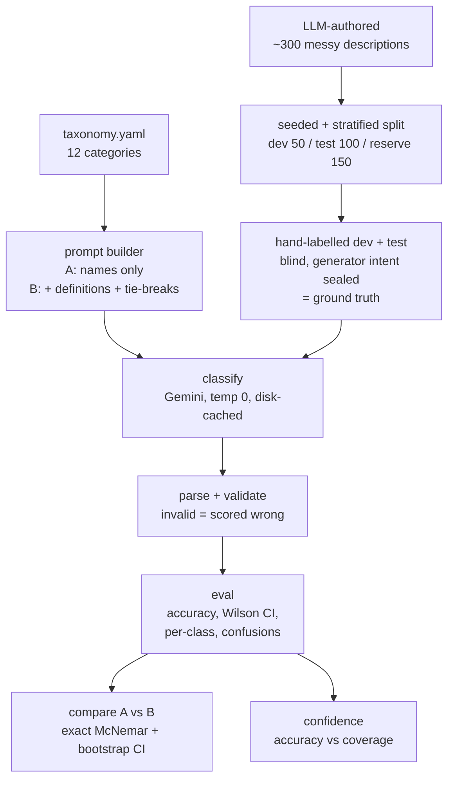

# Build log

## 1. How I framed the problem, and the taxonomy
KOHO's real question is "how do you know it's any good?", so I treated the
**evaluation harness as the deliverable** and the classifier as the easy part.
The classifier is ~30 lines; the harness, the labelling discipline, and the
statistics are the actual work.

I built a 12-category taxonomy for Canadian bank descriptors: Groceries,
Dining, Transport, Shopping, Subscriptions, Bills & Utilities, Health &
Wellness, Entertainment, Travel, Fees & Interest, Income & Transfers, Other.
The design rule that shaped everything: **every tie-break must be decidable
from a single description string alone.** A rule that depends on whether a
payment recurs, or what was physically bought, can't be applied by the model
or by me, so it adds noise instead of signal. That rule forced several
revisions (e.g. Subscriptions defined by merchant type, not recurrence;
pharmacy chains to Health regardless of purchase).

## 2. Where AI helped
- **Claude (browser chat):** a sounding board for design and statistics —
  adversarial review of the evaluation plan, choice of McNemar vs a plain
  two-sample test, and a second opinion that caught flaws in the first
  taxonomy draft. It also sanity-checked my hand-labels against my own rules.
- **Claude Code (terminal):** wrote every harness module, authored the
  synthetic data, and wrote the 57-test suite. I worked in plan mode, approved
  each plan, reviewed every diff, and committed in small pieces so the git
  history shows the supervision.
- I deliberately kept the **authoring model (Claude) separate from the
  classifier (Gemini)**, so the classifier wasn't grading its own family's
  output.

## 3. Where AI got it wrong (the part that matters most)
Four real cases, each caught by review rather than luck:
- **Stale SDK path.** The Gemini quickstart (and the model's own memory)
  pointed at a new Interactions API. I needed `generate_content` for
  temperature 0 and JSON output. Claude Code flagged the mismatch instead of
  following the page — caught because I made it fetch current docs and cite
  them rather than code from memory.
- **Discarded error body.** My `llm.py` threw away the API's error response,
  so when I hit a 429 I couldn't tell whether it was a per-minute or per-day
  limit. Caught when I asked for the error detail and there was nothing saved.
  Fixed to persist the (key-scrubbed) body.
- **A labelling error in my own ground truth.** Both approaches classified
  `FARMBOY` as Groceries against my "Dining" label. Farm Boy is a grocer — my
  label was wrong. Caught because both approaches confidently disagreed with
  me the same way. Lesson: when the model confidently disagrees with ground
  truth, re-check the ground truth. I logged that I only re-checked rows the
  model missed, so this correction process can only ever raise measured
  accuracy — a bias I can name but not fully remove at this scale.
- **A sealed-data leak in a diff.** Claude Code printed rows of the sealed
  generator-intent file while showing a commit, exposing intended categories
  for a few ids. I forced those rows (plus others exposed in progress reports)
  into reserve — 11 in total — so no evaluated row had been seen. Cost: 10 of
  the 11 were ambiguous, so the holdout lost some of its hardest cases.

## 4. What I rejected, and why
- **Few-shot as a core comparison** — my A-vs-B question (does the spec help?)
  is a cleaner single-variable test and needs no examples. Kept as future work.
- **Constraining output to an enum** of the 12 names — it would push invalid
  outputs to ~0 and hide that failure mode. I left output free and scored
  invalids as errors (there were 0, which is itself worth knowing).
- **Tuning the model's thinking budget** — a second variable alongside the
  prompt would confound the comparison.
- **Switching models mid-run** when I hit rate limits — would mix two models
  in one result set. I switched cleanly (flash → flash-lite, forced by quota),
  re-ran everything, and the cache key includes the model so nothing mixes.

## 5. What would worry me in production tomorrow
- **Synthetic optimism.** 99% is a ceiling. I wrote the taxonomy and an LLM
  wrote the data, so the strings fit the categories more neatly than real
  descriptors would. Real traffic would score lower.
- **A useless confidence signal.** B reported only 4 distinct confidence
  values, with 83 of 100 rows at exactly 100. That's far too coarse to decide
  what to auto-accept vs route to a human. I'd need token log-probabilities or
  a self-consistency signal first.
- **Taxonomy gaps.** Government services (SERVICE ONTARIO) have no category and
  read as utilities — the one row both approaches missed. Real data is full of
  merchants a fixed taxonomy never anticipated.
- **Merchant drift.** Processor prefixes and merchant strings change
  constantly. This is a one-off evaluation, not a monitoring loop; production
  needs periodic re-labelling and drift tracking.
- **Thin significance.** The headline rests on 7 discordant rows. I'd want a
  larger labelled set before acting on the size of the gap.

## 6. What I cut, and the fifth hour
Cut: few-shot, a second-model comparison, a perturbation/robustness test, and
a larger labelled set. The fifth hour would go to (1) a **self-consistency
confidence signal**, since self-reported confidence proved too coarse to use,
and (2) running the harness on a **sample of real messy strings** to measure
how far the synthetic ceiling sits from reality. Those two would tell me the
most about whether this survives contact with production.

## Time
~4 hours on the task itself (taxonomy, data, labelling, harness, runs,
analysis), plus setup beforehand (tooling, API key, repo). Hand-labelling 150
rows was the single biggest block, and the most valuable: it's where I found
the genuinely ambiguous cases and my own labelling error.